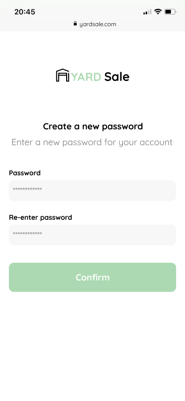
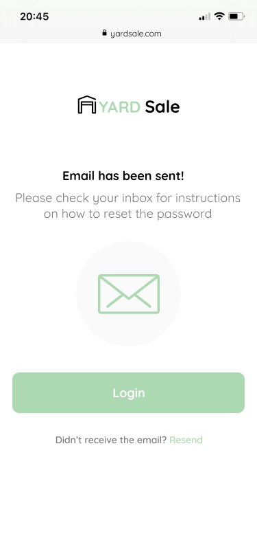

# Curso de Fontend Developer

- [Curso de Fontend Developer](#curso-de-fontend-developer)
  - [Preparación del entorno](#preparación-del-entorno)
  - [Clase 1 - New Password](#clase-1---new-password)
  - [Clase 2 - Email Send](#clase-2---email-send)

Este es el repositorio del curso de frontend developer de Platzi con Estefany Aguilar. Es un curso práctico para profundizar en aspectos más profesionales. Por tanto, se necesita tener conocimientos básicos de HTML y CSS. En este curso no se usa JavaScript.

Se trata de maquetar un proyecto que recibimos con unas especificaciones de pantallas, colores, tipografías, iconos e imágenes. El proyecto incluye las pantallas de sobremesa y de móvil.

## Preparación del entorno

Creamos en nuestra carpeta de trabajo un archivo básico, `html` con el nombre de `index.html`.

```html
<!DOCTYPE html>
<html lang="en">
  <head>
    <meta charset="UTF-8" />
    <meta http-equiv="X-UA-Compatible" content="IE=edge" />
    <meta name="viewport" content="width=device-width, initial-scale=1.0" />
    <title>Document</title>
  </head>
  <body></body>
</html>
```

En este archivo colocaremos los enlaces a las fuentes que usaremos, en este caso _Quicksand_. Estos enlaces los proporciona _Google Fonts_.

```html
<!DOCTYPE html>
<html lang="en">
  <head>
    <meta charset="UTF-8" />
    <meta http-equiv="X-UA-Compatible" content="IE=edge" />
    <meta name="viewport" content="width=device-width, initial-scale=1.0" />
    <link rel="preconnect" href="https://fonts.googleapis.com" />
    <link rel="preconnect" href="https://fonts.gstatic.com" crossorigin />
    <link
      href="https://fonts.googleapis.com/css2?family=Montserrat&family=Quicksand:wght@300;500;700&display=swap"
      rel="stylesheet"
    />
    <title>Document</title>
  </head>
  <body></body>
</html>
```

Aquí, también colocamos los estilos básicos para usar las fuentes y definimos los colores del proyecto.

```html
<!DOCTYPE html>
<html lang="en">
  <head>
    <meta charset="UTF-8" />
    <meta http-equiv="X-UA-Compatible" content="IE=edge" />
    <meta name="viewport" content="width=device-width, initial-scale=1.0" />
    <link rel="preconnect" href="https://fonts.googleapis.com" />
    <link rel="preconnect" href="https://fonts.gstatic.com" crossorigin />
    <link
      href="https://fonts.googleapis.com/css2?family=Montserrat&family=Quicksand:wght@300;500;700&display=swap"
      rel="stylesheet"
    />
    <title>Document</title>
    <style>
      :root {
        --white: #fff;
        --black: #000;
        --very-light-pink: #c7c7c7;
        --text-input-field: #f7f7f7;
        --hospital-green: #acd8b2;
      }
      body {
        font-family: "Quicksand", sans-serif;
      }
    </style>
  </head>
  <body></body>
</html>
```

Obtenemos los iconos y logos especificados y guardamos en sus carpetas correspondientes.

ya tenemos todo listo para empezar a maquetar nuestro proyecto. Cada pantalla se maquetará en un único archivo que incluirá los estilos.

## Clase 1 - New Password

Vamos a desarrollar la pantalla de cambio de contraseña. La pantalla para dispositivos móviles debe quedar como la imagen.

<div style="text-align: center"></div>

La pantalla para escritorio será la misma con la diferencia que no se mostrará el logo. En el escritorio siempre tendremos la barra de navegación y en ella el logo. Esta barra es un componente que estará en todas las pantallas del escritorio, de modo que no la vamos a incluir por el momento.

Como puedes ver, nuestra pantalla contiene un logo (versión móvil), un título, un subtítulo y un formulario con sus correspondientes elementos. podemos decir que se trata de un formulario de cambio de contraseña.

Partiendo del documento `index.html` que creamos anteriormente, vamos a crear un archivo con el nombre `newPassword.html` y aquí añadimos dentro del `body` un bloque que contendrá a su vez otro bloque con todos los elementos.

```html
<!DOCTYPE html>
<html lang="en">
  <head>
    <meta charset="UTF-8" />
    <meta http-equiv="X-UA-Compatible" content="IE=edge" />
    <meta name="viewport" content="width=device-width, initial-scale=1.0" />
    <link rel="preconnect" href="https://fonts.googleapis.com" />
    <link rel="preconnect" href="https://fonts.gstatic.com" crossorigin />
    <link
      href="https://fonts.googleapis.com/css2?family=Montserrat&family=Quicksand:wght@300;500;700&display=swap"
      rel="stylesheet"
    />
    <title>Document</title>
  </head>
  <style>
    :root {
      --white: #fff;
      --black: #000;
      --very-light-pink: #c7c7c7;
      --text-input-field: #f7f7f7;
      --hospital-green: #acd8b2;
      --sm: 14px;
      --md: 16px;
      --lg: 18px;
    }
    body {
      margin: 0;
      font-family: "Quicksand", sans-serif;
    }
  </style>
  <body>
    <div class="login">
      <div class="form-container"></div>
    </div>
  </body>
</html>
```

Al primero le damos la clase `login` y al segundo `form-container`, ya que será el contenedor del formulario. El primer bloque con la clase `login` es el contenedor principal. Tenemos unas cuantas pantallas que desarrollar para manejar los diferentes casos de _login_. Crear una cuenta, entrar a la cuenta, restablecer la contraseña, etc. Todos ellos estaran contenidos en bloque con la clase `login`.

Ahora definimos el resto de elementos y les añadimos clases de estilos que luego iremos configurando.

```html
<!DOCTYPE html>
<html lang="en">
  <head>
    <meta charset="UTF-8" />
    <meta http-equiv="X-UA-Compatible" content="IE=edge" />
    <meta name="viewport" content="width=device-width, initial-scale=1.0" />
    <link rel="preconnect" href="https://fonts.googleapis.com" />
    <link rel="preconnect" href="https://fonts.gstatic.com" crossorigin />
    <link
      href="https://fonts.googleapis.com/css2?family=Montserrat&family=Quicksand:wght@300;500;700&display=swap"
      rel="stylesheet"
    />
    <title>Document</title>
  </head>
  <style>
    :root {
      --white: #fff;
      --black: #000;
      --very-light-pink: #c7c7c7;
      --text-input-field: #f7f7f7;
      --hospital-green: #acd8b2;
      --sm: 14px;
      --md: 16px;
      --lg: 18px;
    }
    body {
      margin: 0;
      font-family: "Quicksand", sans-serif;
    }
  </style>
  <body>
    <div class="login">
      <div class="form-container">
        
        <h1 class="title">Create a new password</h1>
        <p class="subtitle">Enter a new password for you account</p>

        <form action="" class="form">
          <label for="password" class="label">Password</label>
          <input
            type="text"
            id="password"
            class="input input-password"
            placeholder="********"
          />

          <label for="new-password" class="label">Password</label>
          <input
            type="text"
            id="new-password"
            class="input input-password"
            placeholder="********"
          />
          <input
            type="submit"
            class="primary-button login-button"
            value="Confirm"
          />
        </form>
      </div>
    </div>
  </body>
</html>
```

Ya podemos ir añadiendo estilos para que nuestra página quede como nos han especificado. Fíjate que elegimos para el botón un componente `input` de tipo `submit`. En ese caso el texto del botón estará en el `value` del `input`.

Intenta realizar el estilo de los elementos. Utiliza las variables de color y tamaño que creamos al principio. A continuación tienes el código para que compruebes y compares.

```html
<!DOCTYPE html>
<html lang="en">
  <head>
    <meta charset="UTF-8" />
    <meta http-equiv="X-UA-Compatible" content="IE=edge" />
    <meta name="viewport" content="width=device-width, initial-scale=1.0" />
    <link rel="preconnect" href="https://fonts.googleapis.com" />
    <link rel="preconnect" href="https://fonts.gstatic.com" crossorigin />
    <link
      href="https://fonts.googleapis.com/css2?family=Montserrat&family=Quicksand:wght@300;500;700&display=swap"
      rel="stylesheet"
    />
    <title>Document</title>
  </head>
  <style>
    :root {
      --white: #fff;
      --black: #000;
      --very-light-pink: #c7c7c7;
      --text-input-field: #f7f7f7;
      --hospital-green: #acd8b2;
      --sm: 14px;
      --md: 16px;
      --lg: 18px;
    }
    body {
      margin: 0;
      font-family: "Quicksand", sans-serif;
    }
    .login {
      width: 100%;
      height: 100vh;
      display: grid;
      place-items: center;
    }
    .form-container {
      display: grid;
      grid-template-rows: auto 1fr auto;
      max-width: 400px;
    }
    .logo {
      width: 150px;
      margin-bottom: 48px;
      justify-self: center;
      display: none;
    }
    .title {
      font-size: var(--lg);
      font-weight: 700;
      margin-bottom: 12px;
      text-align: center;
    }
    .subtitle {
      color: var(--very-light-pink);
      font-size: var(--lg);
      margin-top: 0;
      margin-bottom: 32px;
      text-align: center;
    }
    .form {
      display: flex;
      flex-direction: column;
    }
    .label {
      font-size: var(--sm);
      font-weight: bold;
      margin-bottom: 4px;
    }
    .input {
      background-color: var(--text-input-field);
      border: none;
      border-radius: 8px;
      height: 30px;
      font-size: var(--md);
      margin-bottom: 12px;
      padding: 6px;
    }
    .primary-button {
      background-color: var(--hospital-green);
      border-radius: 8px;
      border: none;
      color: var(--white);
      width: 100%;
      cursor: pointer;
      font-size: var(--lg);
      font-weight: bold;
      height: 50px;
    }
    .login {
      margin-bottom: 30px;
      margin-top: 14px;
    }
    @media (max-width: 640px) {
      .logo {
        display: block;
      }
    }
  </style>
  <body>
    <div class="login">
      <div class="form-container">
        
        <h1 class="title">Create a new password</h1>
        <p class="subtitle">Enter a new password for you account</p>

        <form action="" class="form">
          <label for="password" class="label">Password</label>
          <input
            type="text"
            id="password"
            class="input input-password"
            placeholder="********"
          />

          <label for="new-password" class="label">Password</label>
          <input
            type="text"
            id="new-password"
            class="input input-password"
            placeholder="********"
          />
          <input
            type="submit"
            class="primary-button login-button"
            value="Confirm"
          />
        </form>
      </div>
    </div>
  </body>
</html>
```

## Clase 2 - Email Send

Seguimos ahora con la pantalla de _email send_. Esta pantalla se muestra cuando hemos solicitado restablecer la contraseña y para ello proporcionamos un _email_ donde recibir las instrucciones para restablecer la contraseña. La imagen se muestra a continuación.

<div style="text-align: center"></div>

Procedemos del mismo modo. Aprovechamos el último archivo que realizamos `newPassword.html` y lo copiamos renombrándolo a `emailSend.html`. Eliminamos todos los elementos que ahora no necesitamos.

Añadimos un bloque `div` para colocar y ajustar el icono del email. convertimos el anterior `input` usado como botón en un elemento `button` y añadimos debajo de él un párrafo con `span` y un enlace para el _Resend_.

Prueba a realizarlo y si tienes dificultades aquí debajo verás el código completo de este nuevo archivo.

```html
<!DOCTYPE html>
<html lang="en">
  <head>
    <meta charset="UTF-8" />
    <meta http-equiv="X-UA-Compatible" content="IE=edge" />
    <meta name="viewport" content="width=device-width, initial-scale=1.0" />
    <link rel="preconnect" href="https://fonts.googleapis.com" />
    <link rel="preconnect" href="https://fonts.gstatic.com" crossorigin />
    <link
      href="https://fonts.googleapis.com/css2?family=Montserrat&family=Quicksand:wght@300;500;700&display=swap"
      rel="stylesheet"
    />
    <title>Document</title>
  </head>
  <style>
    :root {
      --white: #fff;
      --black: #000;
      --very-light-pink: #c7c7c7;
      --text-input-field: #f7f7f7;
      --hospital-green: #acd8b2;
      --sm: 14px;
      --md: 16px;
      --lg: 18px;
    }
    body {
      margin: 0;
      font-family: "Quicksand", sans-serif;
    }
    .login {
      width: 100%;
      height: 100vh;
      display: grid;
      place-items: center;
    }
    .form-container {
      display: grid;
      grid-template-rows: auto 1fr auto;
      max-width: 400px;
      justify-items: center;
    }
    .logo {
      width: 150px;
      margin-bottom: 48px;
      justify-self: center;
      display: none;
    }
    .title {
      font-size: var(--lg);
      font-weight: 700;
      margin-bottom: 12px;
      text-align: center;
    }
    .subtitle {
      color: var(--very-light-pink);
      font-size: var(--lg);
      margin-top: 0;
      margin-bottom: 32px;
      text-align: center;
    }
    .email-image {
      width: 132px;
      height: 132px;
      border-radius: 50%;
      background-color: var(--text-input-field);
      display: flex;
      justify-content: center;
      align-items: center;
      margin-bottom: 24px;
    }
    .email-image img {
      width: 80px;
      height: 80px;
    }
    .resend {
      font-size: var(--sm);
    }
    .resend span {
      color: var(--very-light-pink);
    }
    .resend a {
      color: var(--hospital-green);
      text-decoration: none;
    }
    .resend a:hover {
      font-weight: 700;
    }
    .primary-button {
      background-color: var(--hospital-green);
      border-radius: 8px;
      border: none;
      color: var(--white);
      width: 100%;
      cursor: pointer;
      font-size: var(--lg);
      font-weight: bold;
      height: 50px;
      margin-top: 20px;
    }
    .login {
      margin-bottom: 30px;
      margin-top: 14px;
    }
    @media (max-width: 640px) {
      .logo {
        display: block;
      }
    }
  </style>
  <body>
    <div class="login">
      <div class="form-container">
        
        <h1 class="title">Email has been sent!</h1>
        <p class="subtitle">
          Please check your inbox for instructions on how to reset the password
        </p>
        <div class="email-image">
          
        </div>
        <button class="primary-button login-button">Login</button>
        <p class="resend">
          <span>Didn’t receive the email?</span>
          <a href="/">Resend</a>
        </p>
      </div>
    </div>
  </body>
</html>
```
